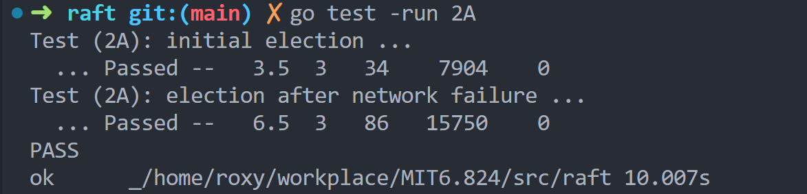

# MIT 6.824: Distributed Systems (Spring 2020)
MIT6.824 study notes and lab solutions.

2023/4：最近刚看完6.824的课和部分论文，接下来专心做lab，因为有工作和毕设的事情，希望5月底做完然后写篇博客，并把这个lab的笔记也补上。

## Lab 1: MapReduce

## Lab 2: Raft

### Part 2A

### Part 2B

### Part 2C

### Part 3A

